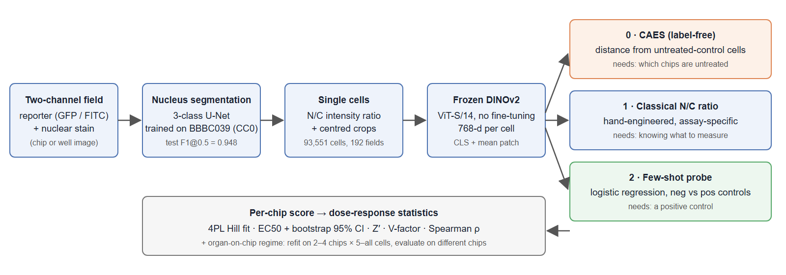
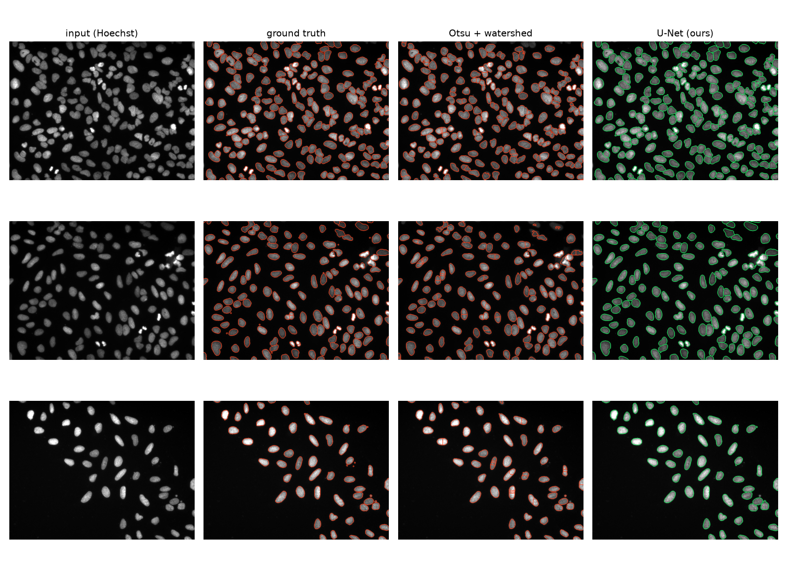
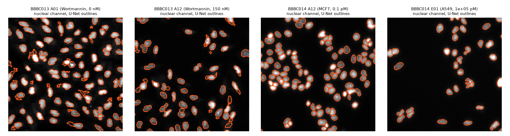
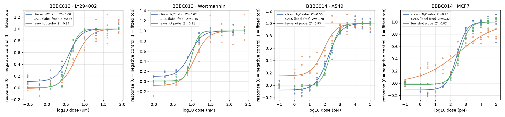
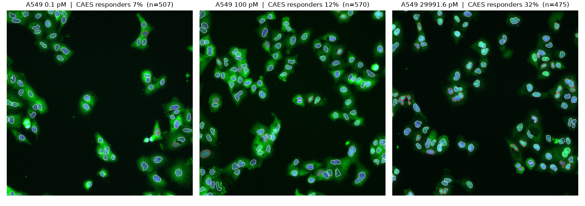
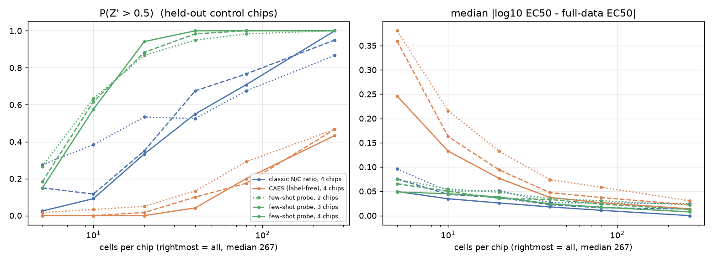
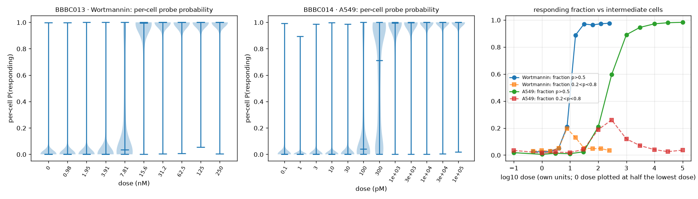
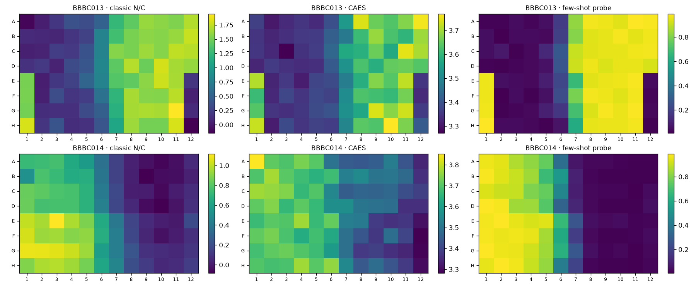
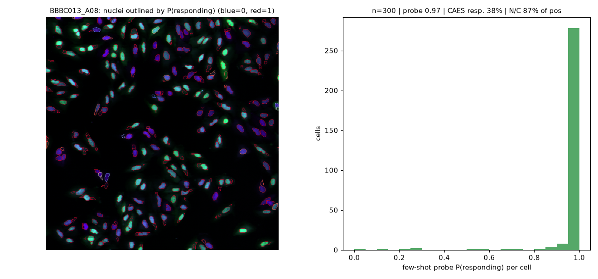

# OoC-Readout: A Label-Matched Imaging Readout Ladder for Organ-on-a-Chip Drug-Response Assays

**Technical report — AI4S Open Innovation: AI for Life Science (AI + Organ-on-a-Chip), 5th Pazhou Algorithm Competition**

**Submission category:** Model & Algorithm
**Team:** Doyoung Kim (single-member team; team leader). Background: AI / software. No biology or clinical team member — the cross-disciplinary bonus is not claimed.
**Code:** public repository `ooc-readout` (MIT licence) — see the Kaggle Writeup for the link. **Everything in this report is regenerated by `reproduce.sh`.**

---

## Summary

Organ-on-a-chip (OoC) devices reproduce human tissue function in vitro, but their imaging readouts are judged with statistics inherited from 96-well screening — while a chip study typically has two to four chips per condition, a handful of fields per chip, and often no validated positive control for a new tissue model. We ask a practical question: *given only the labels an OoC lab actually has, how good can an image-based drug-response readout be, and how many chips does it need?*

OoC-Readout is an end-to-end pipeline — nucleus segmentation (a U-Net trained on BBBC039, test F1@0.5 = 0.948 versus 0.784 for Otsu + watershed), single-cell measurement, frozen self-supervised DINOv2 embeddings, and dose-response statistics (4-parameter Hill fit, EC50 with bootstrap CI, Z′, V-factor). On top of the same embeddings we build a **ladder of three readouts matched to label availability**: (0) **CAES**, a Control-Anchored Embedding Score that needs only untreated control wells; (1) the classical, hand-engineered nuclear/cytoplasmic (N/C) ratio; and (2) a **few-shot linear probe** trained on 8 negative and 8 positive control wells.

On four public translocation dose-response curves (BBBC013: FKHR-GFP in U2OS with Wortmannin and LY294002; BBBC014: NF-κB in MCF7 and A549 lung epithelial cells with TNF-α; 93,551 cells), the few-shot probe reached Z′ = 0.87–0.94 on all four curves (classical N/C ratio: 0.23–0.62; published CellProfiler results on BBBC013: 0.84–0.94) with Hill R² ≥ 0.991; on BBBC013 its EC50 confidence intervals are 1.6–2× narrower (in log units) than the classical readout's and the two agree on EC50. The label-free CAES ranks doses correctly (Spearman ρ = 0.88–0.91) and, on A549 cells, exceeds the classical readout (Z′ 0.78 vs 0.56), but is not a quantitative assay-grade readout on the other curves (Z′ 0.15–0.46). A leakage-free OoC-regime simulation (models re-fitted on 2–4 control chips, evaluated on different chips) shows that the probe reaches P(Z′ > 0.5) = 0.87 with only **2 chips × 20 cells per condition** (0.95 with 40 cells), whereas the classical readout needs all ~267 cells per chip and 3–4 chips. The whole plate (96 fields, ~27k–67k cells) is processed in 50–140 s on one consumer GPU; the demo processes one field in ~2 s.

---

## 1. Problem definition and application scenario

### 1.1 Why the readout, not the chip, is the bottleneck

OoC platforms — lung, liver, gut, kidney and neural chips — co-culture human cells under flow and mechanical cues and are increasingly used for efficacy and toxicity assessment. Most of their endpoints are optical: fixed or live fluorescence imaging of reporters, stains or morphology. Turning images into a dose-response number is where three OoC-specific constraints bite:

1. **Few replicates.** A chip is expensive and laborious; a typical study has 2–4 chips per condition, versus 4–32 wells per condition in plate screening. The standard assay-quality statistic, Z′ = 1 − 3(σ₊ + σ₋)/|μ₊ − μ₋|, was designed for the latter, and its estimate is noisy with few replicates.
2. **Few cells per field.** Channels and membranes restrict the imageable area, and 3D/co-culture regions further limit how many in-focus cells a field contributes.
3. **Missing positive controls.** For a new tissue model or a new endpoint there is often no validated positive control, and the phenotype of interest may be unknown in advance ("did *anything* change?"). Supervised readouts are then not available, and hand-engineered readouts require knowing what to measure.

### 1.2 What we build

A readout pipeline that (i) works from raw two-channel images (a reporter and a nuclear stain), (ii) offers a readout for each level of label availability, and (iii) states — from data — how many chips and cells per chip each readout needs to reach a usable Z′ and a stable EC50. The scenario we target is the analysis step of an OoC drug-response experiment: the scientist provides images of control and treated chips, and receives per-cell scores, per-chip scores, a fitted dose-response curve with EC50 and its uncertainty, and an assay-quality statement.

### 1.3 Why translocation assays

Cytoplasm-to-nucleus translocation of a transcription factor is one of the most common imaging endpoints in both plate and chip assays (inflammation via NF-κB, stress via FOXO/FKHR, hypoxia via HIF). BBBC014 includes **A549 alveolar epithelial cells stimulated with TNF-α**, the canonical inflammatory challenge used in lung-on-a-chip studies (Huh et al., Science 2010, used TNF-α to induce an inflammatory response in the lung-on-a-chip). BBBC013 has published assay-quality numbers, which lets us check our statistics against an external reference.

### 1.4 Contributions

1. A complete, reproducible, open pipeline (code + trained weights + one-command reproduction) from raw images to dose-response statistics.
2. **CAES**, a control-anchored score on frozen foundation-model embeddings that needs no positive control and no labels, with leakage-free cross-fitting so that control wells are never scored by a model that saw them.
3. A **head-to-head comparison** of label-free, hand-engineered and few-shot readouts on four curves, two cell types per plate and two plates, with Z′, V-factor, Hill R², bootstrap EC50 CIs and rank correlation.
4. An **OoC-regime sample-efficiency analysis**: models are re-fitted on 2–4 control "chips" with 5–all cells each and evaluated on *different* control chips, giving the probability of Z′ > 0.5 and the EC50 error as a function of chips and cells.

---

## 2. Related work (brief)

**Translocation and image-based screening.** Carpenter et al. (Genome Biology 2006) introduced CellProfiler and reported Z′ on BBBC013; Logan & Carpenter (J. Biomol. Screening 2010) reported improved Z′ and V-factors on the same plate. Ravkin's V-factor (2004) generalises Z′ to the whole dose curve.
**Nucleus segmentation.** Caicedo et al. (Cytometry A 2019) released BBBC039 and showed that a 3-class (background / interior / boundary) U-Net is a strong segmenter; we follow that formulation.
**Self-supervised features for cell images.** DINOv2 (Oquab et al. 2023) is a general-purpose self-supervised vision transformer; DINO-family features have been shown to transfer to cell-painting profiling. We use DINOv2 *frozen*, as a fixed featuriser, which keeps the method cheap and reproducible.
**Anomaly scoring against controls.** Mahalanobis-distance scoring in a feature space fitted on in-distribution samples is a classical out-of-distribution detector; image-based profiling commonly expresses treatment effects relative to negative controls. CAES combines both and adds well-level cross-fitting.

---

## 3. Data sources, licences and compliance

| Dataset | Content | Size used | Licence | Role |
|---|---|---|---|---|
| **BBBC039v1** (Caicedo et al. 2018/2019) | U2OS, Hoechst, 200 fields 520×696, ~23,000 manually annotated nuclei; official train/validation/test split | 100 / 50 / 50 images; 5,720 nuclei in test | **CC0** | Train and test the segmenter |
| **BBBC013v1** (provided by Ilya Ravkin) | U2OS, FKHR-EGFP + DRAQ DNA, 96 wells; Wortmannin 9-point 2-fold dilution (0.98–250 nM) and LY294002 (0.31–80 µM), 4 replicates each; 8 negative and 8 positive (150 nM Wortmannin) control wells | 96 fields, **26,359 cells** | **CC BY 3.0** | Main validation (published Z′ available) |
| **BBBC014v1** (provided by Ilya Ravkin) | MCF7 (rows A–D) and **A549** (rows E–H), NF-κB FITC + DAPI, 12 TNF-α concentrations (10⁻¹³–10⁻⁷ M), 4 replicates | 96 fields, **67,192 cells** | **CC BY 3.0** | Second plate, two cell types |

Citation as requested by the collection: *"We used image sets BBBC013v1 and BBBC014v1 provided by Ilya Ravkin, and BBBC039v1 (Caicedo et al. 2018), available from the Broad Bioimage Benchmark Collection [Ljosa et al., Nature Methods, 2012]."*

**Processing.** Images are read as provided (8-bit BMP for BBBC013/014, 16-bit TIFF for BBBC039). Plate metadata for BBBC013 is taken from the authors' CellProfiler metadata files shipped with the set (`BBBC013_reproduce_logan.zip`); BBBC014 uses the official plate map. For BBBC014 we verified visually that Channel 2 is the nuclear (DAPI) channel and Channel 1 the NF-κB reporter. BBBC014 has no separate control wells; we use the lowest concentration (10⁻¹³ M, column 12) as the negative reference and the highest (10⁻⁷ M, column 1) as the positive reference.

**Compliance.** All data are public cell-line images; there is no personal, clinical or restricted data, and no human-subject information. No competition or dataset image was uploaded to any external service; all computation ran on a local workstation. Datasets are not redistributed in the repository — `scripts/download_data.py` fetches them from the original source.

**Limitation stated up front:** none of these images come from an organ-on-a-chip. The OoC regime is addressed by simulation (Section 5.8); validation on real chip data is the next step (Section 9).

---

## 4. System architecture



*Figure 1. Pipeline. Two-channel fields → nucleus instance segmentation (U-Net, trained on BBBC039) → single-cell measurements (N/C ratio) and crops → frozen DINOv2 ViT-S/14 embeddings → three readouts matched to the labels available → per-chip scores → Hill fit, EC50 ± bootstrap CI, Z′, V-factor, and the OoC sample-efficiency analysis.*

The repository is organised as a small library plus entry scripts:

| Module / script | Responsibility |
|---|---|
| `ooc_readout/data.py` | Parallel downloader (the source server is slow per connection), dataset loaders, plate metadata |
| `ooc_readout/seg.py` | 3-class U-Net, instance recovery, Otsu+watershed baseline, magnification calibration, instance F1 |
| `ooc_readout/cells.py` | Per-cell nuclear / cytoplasmic-ring intensities and crops |
| `ooc_readout/embed.py` | Frozen DINOv2 featuriser |
| `ooc_readout/scoring.py` | CAES, few-shot probe, Z′, V-factor, Hill fit, bootstrap |
| `scripts/train_segmentation.py`, `evaluate_segmentation.py` | Segmenter training and held-out test |
| `scripts/run_assay.py` | End-to-end readout of one plate |
| `scripts/sample_efficiency.py` | OoC-regime simulation |
| `scripts/ablation.py`, `make_figures.py` | Ablations, figures, tables |
| `scripts/demo.py` | One field in → per-cell and per-field readout out |

---

## 5. Methods

### 5.1 Nucleus segmentation

We train a compact U-Net (4 levels, 32–256 channels, 7.77 M parameters) to predict three classes per pixel — background, nucleus interior, and a 2-pixel nucleus boundary — following Caicedo et al. (2019). Targets are derived from the instance masks; the boundary class is weighted 10× in the cross-entropy loss. Training uses the official BBBC039 training split (100 images), random 256×256 crops, 90° rotations and flips, and photometric augmentation (gamma 0.7–1.4, gain 0.7–1.3, Gaussian noise) intended to help transfer to other microscopes. Optimiser: AdamW, one-cycle schedule (max LR 2×10⁻³), 60 epochs × 100 iterations, batch 16; the checkpoint with the best validation F1@0.5 (50 validation images) is kept. Instances are recovered by labelling connected interior components and growing them by watershed into the interior+boundary foreground; inference averages the prediction with a horizontally flipped copy.

**Magnification calibration.** BBBC013/014 were acquired with different optics from BBBC039. Rather than retraining, each plate is rescaled so that the median nucleus area of its *negative-control* fields (estimated with Otsu + watershed, no labels) matches the median nucleus area of the BBBC039 training masks (627 px). The estimated factors were 2.01 (BBBC013) and 2.04 (BBBC014); label maps are resized back with nearest-neighbour interpolation.

**Baseline.** Gaussian smoothing, Otsu threshold, distance-transform peak markers (minimum distance 5 px) and watershed.

**Metric.** Instance F1 at IoU thresholds 0.5–0.9 with one-to-one matching (unique by construction for IoU > 0.5).

### 5.2 Single-cell measurements (classical readout)

For each nucleus we measure the background-subtracted (5th percentile) reporter intensity in the nucleus and in a 4-pixel cytoplasmic ring separated from the nucleus by a 1-pixel gap and excluding neighbouring nuclei (`expand_labels`). The classical readout is **log(nuclear mean / ring mean)**, the quantity used by translocation pipelines; the well score is the mean over cells.

### 5.3 Single-cell embeddings

Each cell is cropped as a square of about three nucleus diameters (46 px on BBBC013, 44 px on BBBC014, determined from the data) from per-field percentile-normalised reporter and nuclear channels, mapped to RGB as (reporter, nucleus, reporter), resized to 112×112 and passed through **DINOv2 ViT-S/14 without any fine-tuning**. The 768-d embedding concatenates the normalised CLS token and the mean patch token.

### 5.4 Readout 0 — CAES (Control-Anchored Embedding Score), no positive control

CAES asks how far a cell's embedding lies from the distribution of untreated cells. Fitted on negative-control cells only:

1. standardise the 768 dimensions; 2. PCA to k = 32 components; 3. Ledoit–Wolf shrinkage covariance in PCA space; 4. cell score = log Mahalanobis distance; 5. well score = mean cell score.

A responder threshold (95th percentile of distances of *other* control wells' cells) is used for visual overlays only. To avoid scoring a control well with a model that saw it, every control well is scored by a model fitted without that well (leave-one-well-out); the remaining control wells are split in half — one half fits the space and the other calibrates the threshold. Treated wells are scored by a model fitted on all control wells. CAES uses exactly the information an OoC lab always has: *which chips were untreated*.

### 5.5 Readout 2 — few-shot linear probe

An L2-regularised logistic regression (C = 0.1) on standardised embeddings, trained to separate cells of negative-control wells from cells of positive-control wells; well score = mean predicted probability. Control wells are again scored leave-one-well-out. On BBBC013, 8 negative + 8 positive control wells are used; on BBBC014, 4 + 4 per cell line. The probe never sees a dose label or a treated sample well.

### 5.6 Dose-response statistics

* **Hill fit:** 4-parameter logistic in log10 dose on all positive-dose sample wells (BBBC013: 9 doses × 4 replicates per drug; BBBC014: 12 × 4 per cell line), bounded slope 0.1–10.
* **EC50 95% CI:** 300 bootstrap resamples of wells within each dose.
* **Z′:** negative-control wells vs top-dose wells ("Z′ top") and vs positive-control wells ("Z′ pos").
* **V-factor:** 1 − 6·mean(within-dose SD) / |top − bottom| of the fitted curve.
* **Spearman ρ** between well score and log dose (monotonicity without a model).

### 5.7 Leakage control

(i) The segmenter is trained only on BBBC039; BBBC013/014 are never used for training it. (ii) CAES and the probe are fitted only on control wells; no dose label is used. (iii) Control wells are scored out-of-fold. (iv) The EC50 references in Section 7.5 come from the full-data fit, but every sub-sampled evaluation uses control chips disjoint from the training chips.

### 5.8 OoC-regime sample-efficiency protocol

We emulate a chip study by sub-sampling BBBC013: for m ∈ {2, 3, 4} chips per condition and k ∈ {5, 10, 20, 40, 80, all} cells per chip, we draw m negative and m positive control wells as *training chips*, refit CAES and the probe on k cells from each, draw m *different* negative control wells as *evaluation chips*, draw m replicate wells per dose, and compute Z′ (evaluation negatives vs top dose) and the EC50 error |log10 EC50_sub − log10 EC50_full|. Each setting is repeated 60 times per drug.

---

## 6. Implementation details

* Hardware: one NVIDIA GeForce RTX 4080 SUPER (16 GB), Windows 11; CPU-only execution is supported (slower).
* Software: Python 3.11, PyTorch 2.6 (CUDA 12.4), scikit-learn 1.9, scikit-image 0.26 (pinned in `requirements.txt`).
* Runtime: segmenter training 15 min (60 epochs); test evaluation < 1 min; BBBC013 plate end-to-end 50 s (26,359 cells), BBBC014 140 s (67,192 cells), including DINOv2 embedding; `demo.py` on one field ≈ 2 s after model loading.
* Model files: `models/unet3_bbbc039.pt` (31 MB) is in the repository; DINOv2 weights are downloaded automatically from the official torch.hub entry point.
* Determinism: fixed seeds for training, PCA, bootstrap and sub-sampling.

---

## 7. Experiments and results

### 7.1 Segmentation (held-out BBBC039 test split, 50 images, 5,720 nuclei)

| Method | F1@0.5 | F1@0.6 | F1@0.7 | F1@0.8 | F1@0.9 | mean F1 0.5–0.9 | TP / FP / FN @0.5 |
|---|---|---|---|---|---|---|---|
| Otsu + watershed | 0.784 | 0.718 | 0.687 | 0.625 | 0.439 | 0.651 | 4,739 / 1,429 / 981 |
| **U-Net (ours)** | **0.948** | **0.939** | **0.922** | **0.871** | **0.529** | **0.842** | 5,275 / 85 / 445 |

The U-Net removes 94% of the baseline's false positives and halves its misses. Most remaining errors are missed nuclei in dense clumps.



*Figure 2. Held-out BBBC039 test images: input, ground truth, baseline and U-Net outlines.*

**Transfer to the assay plates.** BBBC013 and BBBC014 have no nucleus masks, so transfer was checked qualitatively (Figure 2b) and through a sanity statistic: the number of segmented cells per field is stable across doses (BBBC013 median 267, range 189–429; BBBC014 median 679, range 378–1,169), so the dose response is not an artefact of cell counting. The most visible failure mode is on BBBC013, whose DRAQ DNA stain also faintly labels cytoplasm: a few thin cytoplasmic fragments are segmented as small "nuclei" next to real ones. These objects carry little weight in well means but would matter for single-cell statistics; a size/shape filter is a straightforward addition.



*Figure 2b. U-Net outlines on the nuclear channel of BBBC013 (DRAQ, U2OS) and BBBC014 (DAPI, MCF7 and A549) after automatic magnification calibration; no retraining.*

### 7.2 Dose-response on four curves



*Figure 3. Well scores (dots) and Hill fits (lines) for the three readouts, each rescaled so that 0 = negative-control mean and 1 = fitted top. Legends give Z′ (negative controls vs top dose).*

| Plate | Group | Readout | Z' (neg vs top dose) | Z' (neg vs pos ctrl) | V-factor | Hill R² | EC50 [95% CI] | Spearman ρ (log dose) |
|---|---|---|---|---|---|---|---|---|
| BBBC013 | LY294002 | classic N/C ratio | 0.60 | 0.55 | 0.51 | 0.965 | 3.76 [3.34–4.22] uM | 0.93 |
| BBBC013 | LY294002 | CAES (label-free) | 0.46 | 0.28 | 0.45 | 0.946 | 5.77 [5.01–6.93] uM | 0.91 |
| BBBC013 | LY294002 | few-shot probe | 0.94 | 0.91 | 0.82 | 0.993 | 3.98 [3.68–4.27] uM | 0.93 |
| BBBC013 | Wortmannin | classic N/C ratio | 0.62 | 0.55 | 0.57 | 0.975 | 9.17 [8.3–10.3] nM | 0.93 |
| BBBC013 | Wortmannin | CAES (label-free) | 0.15 | 0.28 | 0.32 | 0.927 | 12.2 [10.7–14.9] nM | 0.91 |
| BBBC013 | Wortmannin | few-shot probe | 0.91 | 0.91 | 0.84 | 0.996 | 10.1 [9.6–10.7] nM | 0.92 |
| BBBC014 | A549 | classic N/C ratio | 0.56 | 0.56 | 0.71 | 0.983 | 170 [153–195] pM | 0.91 |
| BBBC014 | A549 | CAES (label-free) | 0.78 | 0.78 | 0.37 | 0.909 | 84.6 [44.4–124] pM | 0.88 |
| BBBC014 | A549 | few-shot probe | 0.93 | 0.93 | 0.84 | 0.994 | 232 [201–283] pM | 0.93 |
| BBBC014 | MCF7 | classic N/C ratio | 0.23 | 0.23 | 0.68 | 0.974 | 256 [227–296] pM | 0.88 |
| BBBC014 | MCF7 | CAES (label-free) | 0.32 | 0.32 | 0.46 | 0.874 | 343 [84.6–6.5e+06] pM | 0.91 |
| BBBC014 | MCF7 | few-shot probe | 0.87 | 0.87 | 0.85 | 0.991 | 389 [322–461] pM | 0.95 |

*Table 1. Units: BBBC013 Wortmannin nM, LY294002 µM; BBBC014 TNF-α pM. For BBBC014 the "positive control" is the top concentration, so both Z′ columns coincide.*



*Figure 3b. A549 cells (BBBC014) at 0.1 pM, 100 pM and 30 nM TNF-α. Green: NF-κB reporter, blue: DAPI. Nuclei flagged by CAES as outside the untreated-cell distribution are outlined in red, others in white. NF-κB moves from cytoplasm to nucleus with dose; the CAES responder fraction rises from 7% to 32%.*

Key observations:

1. **The few-shot probe is the best readout on every curve** (Z′ 0.87–0.94, V-factor 0.82–0.85, Hill R² ≥ 0.991). It needs only control wells — no dose labels and no assay-specific engineering — and it is the same code for FKHR and NF-κB, U2OS, MCF7 and A549.
2. **EC50 precision.** On BBBC013 the probe's 95% CI is 1.6–2× narrower in log10 units than the classical readout's (Wortmannin 9.6–10.7 nM vs 8.3–10.3 nM; LY294002 3.68–4.27 µM vs 3.34–4.22 µM) and the two readouts agree on the EC50 within their CIs — the probe measures the same biology more precisely. On BBBC014 the opposite holds: the classical CI is narrower (A549 153–195 vs 201–283 pM; MCF7 227–296 vs 322–461 pM) and the probe's EC50 is shifted ~1.4× to higher concentrations. The probe is trained on the extreme concentrations only and saturates later along the curve; which EC50 is "right" cannot be decided without an orthogonal measurement, so we report both.
3. **The classical readout is fragile across cell types.** Our N/C implementation reaches Z′ 0.60–0.62 on BBBC013 but only 0.23 on MCF7, where nuclei are tightly packed and the cytoplasmic ring is contaminated by neighbours. The published CellProfiler pipelines on BBBC013 (with illumination correction and tuned object identification) report Z′ 0.84–0.94; we did not tune our classical readout and include it as a transparent reference, not a straw man.
4. **The label-free CAES is a discovery-grade readout.** It orders doses correctly on all curves (ρ 0.88–0.91) and on A549 lung epithelium it is *better* than the classical readout (Z′ 0.78 vs 0.56). On BBBC013 it is weaker (Z′ 0.15–0.46): a frozen generic featuriser spends most of its variance on cell shape and density, of which the translocation signal is a small part. EC50 estimates are shifted relative to the targeted readouts (e.g. Wortmannin 12.2 nM vs 9.2–10.1 nM) because CAES responds to any change, not only to the reporter's location.

### 7.3 Comparison with published results on BBBC013

| Source | Readout | Z′ (as reported) |
|---|---|---|
| Carpenter et al. 2006 | CellProfiler, hand-engineered | 0.91 / 0.86 / 0.84 (Wortmannin / LY294002 / both) |
| Logan & Carpenter 2010 | CellProfiler, improved | 0.94 / 0.90 / 0.86 |
| **This work** | few-shot probe on frozen DINOv2 | **0.91 (Wortmannin), 0.94 (LY294002), 0.91 (neg vs pos controls)** |
| This work | classical N/C, untuned | 0.62 / 0.60 / 0.55 |

The exact definition of the positive group in the published Z′ values is not stated on the dataset page, so the comparison is indicative. The point is that a generic, untuned featuriser plus 16 control wells matches a mature hand-engineered pipeline built specifically for this assay.

### 7.4 Ablations

| Readout | Tokens | Setting | BBBC013/Wortmannin | BBBC013/LY294002 | BBBC014/A549 | BBBC014/MCF7 | mean |
|---|---|---|---|---|---|---|---|
| CAES | cls+patch | PCA k=8 | -1.13 | -1.03 | 0.40 | 0.25 | -0.38 |
| CAES | cls+patch | PCA k=16 | -0.06 | 0.26 | 0.55 | 0.04 | 0.20 |
| CAES | cls+patch | PCA k=32 | 0.39 | 0.61 | 0.68 | 0.19 | 0.47 |
| CAES | cls+patch | PCA k=64 | 0.46 | 0.77 | 0.69 | 0.49 | 0.60 |
| CAES | cls | PCA k=8 | 0.03 | 0.03 | 0.47 | 0.30 | 0.21 |
| CAES | cls | PCA k=16 | 0.29 | 0.50 | 0.51 | -0.05 | 0.31 |
| CAES | cls | PCA k=32 | 0.52 | 0.63 | 0.63 | 0.26 | 0.51 |
| CAES | cls | PCA k=64 | 0.35 | 0.63 | 0.63 | 0.44 | 0.51 |
| CAES | patch | PCA k=8 | -2.79 | -1.41 | 0.57 | -0.03 | -0.92 |
| CAES | patch | PCA k=16 | -0.72 | 0.06 | 0.62 | 0.11 | 0.02 |
| CAES | patch | PCA k=32 | 0.11 | 0.51 | 0.64 | 0.20 | 0.37 |
| CAES | patch | PCA k=64 | 0.36 | 0.73 | 0.64 | 0.43 | 0.54 |
| probe | cls+patch | C=0.01 | 0.89 | 0.94 | 0.91 | 0.86 | 0.90 |
| probe | cls+patch | C=0.1 | 0.91 | 0.94 | 0.93 | 0.87 | 0.91 |
| probe | cls+patch | C=1.0 | 0.92 | 0.95 | 0.94 | 0.89 | 0.92 |
| probe | cls | C=0.01 | 0.89 | 0.93 | 0.90 | 0.84 | 0.89 |
| probe | cls | C=0.1 | 0.91 | 0.94 | 0.92 | 0.86 | 0.91 |
| probe | cls | C=1.0 | 0.92 | 0.95 | 0.93 | 0.87 | 0.92 |
| probe | patch | C=0.01 | 0.84 | 0.92 | 0.89 | 0.84 | 0.87 |
| probe | patch | C=0.1 | 0.87 | 0.93 | 0.92 | 0.87 | 0.90 |
| probe | patch | C=1.0 | 0.88 | 0.93 | 0.93 | 0.87 | 0.91 |

*Table 2. Z′ (negative controls vs top dose) for embedding readouts under different settings; rows = configuration, columns = curve.*

* The probe is insensitive to its regularisation and token choice (mean Z′ 0.87–0.92 across all 9 settings): the result is not the product of tuning.
* CAES is sensitive to the PCA dimension: k = 8 collapses (negative Z′), k ≥ 32 is needed. The pre-specified main setting (k = 32, fitted on half of the control wells so the other half can calibrate the responder threshold) is not the best configuration; fitting on all remaining control wells with k = 64 reaches a mean Z′ of 0.60. We report the pre-specified setting as the main result and the ablation separately, to avoid selecting hyper-parameters on the evaluation curves.

### 7.5 OoC-regime sample efficiency



*Figure 4. BBBC013, both drugs pooled, 60 repetitions per setting. Left: probability that Z′ (held-out negative control chips vs top-dose chips) exceeds 0.5. Right: median deviation of the sub-sampled EC50 from the same readout's full-data EC50 (log10 units; 0.05 ≈ 12%). Line style = chips per condition (dotted 2, dashed 3, solid 4).*

**Probability that Z′ > 0.5** (both drugs averaged):

| Readout | chips per condition | 5 cells | 10 | 20 | 40 | 80 | all (~267) |
|---|---|---|---|---|---|---|---|
| few-shot probe | 2 | 0.27 | 0.63 | 0.87 | 0.95 | 0.98 | 1.00 |
| few-shot probe | 4 | 0.15 | 0.57 | 0.94 | 1.00 | 1.00 | 1.00 |
| classical N/C | 2 | 0.27 | 0.38 | 0.53 | 0.52 | 0.68 | 0.87 |
| classical N/C | 4 | 0.02 | 0.09 | 0.33 | 0.55 | 0.71 | 1.00 |
| CAES | 2 | 0.02 | 0.03 | 0.05 | 0.13 | 0.29 | 0.47 |
| CAES | 4 | 0.00 | 0.00 | 0.00 | 0.04 | 0.20 | 0.43 |

*Table 3. Models are re-fitted on the sub-sampled control chips only and evaluated on different control chips.*

**Median EC50 deviation from the full-data fit** (log10 units, 2 chips per condition):

| Readout | chips | 5 cells | 10 | 20 | 40 | 80 | all |
|---|---|---|---|---|---|---|---|
| few-shot probe | 2 | 0.075 | 0.055 | 0.048 | 0.035 | 0.031 | 0.022 |
| classical N/C | 2 | 0.096 | 0.050 | 0.052 | 0.026 | 0.026 | 0.025 |
| CAES | 2 | 0.380 | 0.216 | 0.133 | 0.074 | 0.058 | 0.031 |

*Table 4. This measures precision (stability under sub-sampling) of each readout relative to its own full-data estimate, not accuracy against a ground-truth EC50.*

Findings, stated as a planning rule for a chip study with this kind of endpoint:

1. **With a positive control, 2 chips × 20 cells per condition is enough.** The few-shot probe reaches P(Z′ > 0.5) = 0.87 at 2 chips × 20 cells and 0.95 at 2 chips × 40 cells, while the classical readout needs all ~267 cells per chip and 3–4 chips to get to ≥ 0.95. Adding chips helps less than adding cells for the probe: 20 cells per chip is the knee of the curve.
2. **Very few cells per chip break every readout.** At 5 cells per chip no readout reaches Z′ > 0.5 reliably (P ≤ 0.28). Imaging enough of the chip to get ≥ 20 segmented cells per condition is the first requirement. Note also that with 2 chips the Z′ estimate itself is unstable (an SD from two values) and optimistic — the classical readout appears *better* with 2 chips than with 4 at 5 cells — which is an argument for ≥ 3 chips per condition when Z′ is the acceptance criterion.
3. **EC50 is more robust than Z′.** With 2 chips × 20 cells the probe's EC50 stays within 0.05 log units (~12%) of its full-data value; the classical readout is comparably stable. CAES needs ≥ 40 cells per chip before its EC50 stabilises (0.07 log units at 2 chips × 40 cells).
4. **Label-free CAES is not an assay-grade readout in this regime** (P(Z′ > 0.5) ≤ 0.47 even with all cells), consistent with Section 7.2. Its role in a chip study is detection and ranking, and its use of all available cells is essential.


### 7.6 Single-cell heterogeneity of the response

Because every readout is computed per cell, OoC-Readout also shows *how* a population responds. Figure 5 plots the distribution of the probe's per-cell probability at every dose.



*Figure 5. Left and centre: per-cell probe probability by dose (violins) for Wortmannin (BBBC013) and TNF-α on A549 (BBBC014). Right: fraction of cells with p > 0.5 and fraction of "intermediate" cells (0.2 < p < 0.8) versus dose.*

The response is dominated by a change in the *fraction* of responding cells rather than a uniform shift of all cells: for Wortmannin the fraction with p > 0.5 jumps from 5% (3.9 nM) through 21% (7.8 nM) to 89% (15.6 nM), and intermediate cells peak at 20% around the EC50. A549 cells respond more gradually — the fraction rises from 2% (30 pM) to 21% (100 pM), 60% (300 pM) and 89% (1 nM), with intermediate cells peaking at 26%. A caveat: a logistic probe trained on the two extremes pushes cells towards 0 or 1, so the bimodality is partly a property of the classifier; the *difference* between the two curves (switch-like FOXO export block versus graded NF-κB activation) is the observation we consider robust, since the same classifier type is used for both. For organ-on-a-chip work, this per-cell view is what allows a tissue's sub-populations (e.g. responsive epithelium versus unresponsive stroma) to be separated rather than averaged.

### 7.7 Plate-layout quality control



*Figure 6. Well scores of the three readouts laid out on the two plates. BBBC013: Wortmannin rows A–D, LY294002 rows E–H, dose increasing to the right, control wells in columns 1 and 12. BBBC014: MCF7 rows A–D, A549 rows E–H, TNF-α decreasing to the right.*

The heat maps are the first thing an operator should look at before trusting a curve. They show the expected dose gradients and the control columns, and no row or edge artefact on either plate for the classical or probe readouts. CAES is visibly noisier (e.g. the low outlier in BBBC013 well C03, and a weaker contrast between control and treated columns on BBBC013), in line with its lower Z′. On a chip platform the same view becomes a per-chip, per-channel layout, where position effects (inlet versus outlet, flow gradients) are a known concern.

### 7.8 Demo

`python scripts/demo.py --plate BBBC013 --well A08` (31.25 nM Wortmannin) segments 300 nuclei, embeds them and outputs the classical N/C response (87% of the positive control), CAES responder fraction (38%), and the probe's mean probability of responding (0.97), together with an overlay and a per-cell histogram, in ≈ 2.5 s. The same script accepts any reporter/nucleus image pair (`--reporter`, `--nucleus`), which is how a chip image would be analysed.



*Figure 7. Demo output for one field: nuclei outlined by the probe's per-cell probability of responding, and the per-cell distribution.*

---

## 8. Reliability analysis and limitations

* **No organ-on-a-chip images were used.** The OoC regime is simulated by sub-sampling plate data. Chip images add optical challenges we did not test: membranes and PDMS autofluorescence, out-of-focus 3D tissue, flow-induced cell elongation, and co-culture. The magnification calibration and the photometric augmentation are designed to absorb some of this, but this must be validated on real chips.
* **Two endpoints, three cell lines.** Both plates measure translocation. Readouts of cytotoxicity, morphology or barrier function were not evaluated.
* **The probe needs a positive control.** Where none exists, only CAES applies, and CAES is not an assay-grade readout on every curve. CAES answers "did these chips change?" reliably in rank order; it does not say *how* they changed.
* **CAES is not specific.** It responds to any deviation from untreated cells (including toxicity, debris, or focus problems). A quality-control step (focus and debris filters) would be needed before using it on chips.
* **BBBC014 control definition.** The plate has no dedicated controls, so the extreme concentrations stand in for them; Z′ on BBBC014 is therefore Z′ between extreme doses.
* **Classical readout not tuned.** We did not reproduce the published CellProfiler pipelines (illumination correction, tuned object identification); our classical numbers are lower than published and should not be read as the ceiling of hand-engineered readouts.
* **Segmenter transfer was checked visually**, not against ground truth, on BBBC013/014 (no masks are available for these sets).
* **Statistical uncertainty.** Z′ itself is uncertain with 4–8 wells per group; Section 7.5 reports its distribution under sub-sampling rather than a single value.

---

## 9. Potential scientific and practical impact

1. **Experimental design for chip studies.** The sample-efficiency curves translate directly into a planning rule — how many chips to fabricate and how many cells to image per chip to reach a target Z′ and EC50 precision — which matters when each chip costs days of work.
2. **A readout for every stage of model development.** In a new OoC model, CAES can be used from day one (only untreated chips needed) to detect that a treatment does something; once a reference compound is established, the few-shot probe turns the same images into an assay-grade readout without new code.
3. **Reusable across endpoints.** The probe and CAES operate on generic embeddings; the same code covered two transcription factors and three cell lines. Hand-engineered readouts must be re-designed per endpoint.
4. **Towards data assets and digital twins.** Per-cell embeddings are compact (768 numbers per cell) and can be stored as the standardised "data asset" of an OoC experiment, re-scored later with new probes — a step towards the AI-driven OoC digital twins described by the challenge supporter.

### 9.1 A practical protocol for an organ-on-a-chip study

Based on Sections 7.2–7.7, we suggest the following when an OoC lab adopts this readout for a reporter-based endpoint:

1. **Image** at least 20 segmentable cells per chip per condition (40 for margin), with a nuclear stain in every acquisition.
2. **Always include untreated chips** (≥ 3) in each run. They are all that CAES needs and they anchor every other readout.
3. **New model, no reference compound:** run CAES. Read the result as a ranking and a yes/no "something changed" signal; do not use its Z′ as an acceptance criterion.
4. **Once a reference compound exists:** add ≥ 2 positive-control chips, train the few-shot probe (one command, seconds), and use its per-chip scores for dose-response fitting. Expect Z′ > 0.5 with ≥ 2 chips × 20 cells.
5. **Before trusting a curve:** inspect the chip-layout heat map (Section 7.7), the per-cell distributions (Section 7.6) and the overlays produced by `demo.py`.
6. **Report** EC50 with its bootstrap CI and Z′ with the number of chips used — not just the point values.

Next steps: validate on neural and lung OoC imaging data (partnering with an OoC lab), add focus/debris QC, and fine-tune the featuriser self-supervised on chip images.

---

## 10. Reproduction

```bash
git clone <repository> && cd ooc-readout
python -m venv .venv && . .venv/bin/activate    # Windows: .venv\Scripts\activate
pip install torch==2.6.0 torchvision==0.21.0 --index-url https://download.pytorch.org/whl/cu124   # or CPU build
pip install -r requirements.txt
bash reproduce.sh          # downloads data (~360 MB), trains or reuses the segmenter, runs everything
python scripts/demo.py --plate BBBC013 --well A08
```

Outputs: `results/segmentation_test.json`, `results/<plate>/curves.json`, `results/summary.md`, `results/ablation.md`, `results/BBBC013/sample_efficiency_summary.csv`, figures in `results/`. The trained segmenter is included (`models/unet3_bbbc039.pt`); delete it to retrain. No paid service, proprietary hardware or non-public data is required.

---

## 11. External models, libraries, datasets and AI tools (disclosure)

Under Challenge Rules §4, the following are disclosed (full text in `AI_DISCLOSURE.md`):

* **Claude (model Claude Opus 5.5) via Claude Code, Anthropic** — generative AI coding assistant. Used to select datasets and check licences, write the code in the repository, run the experiments on the team's local workstation, and draft this report, the README, the Writeup and the video narration script, and to assemble the demo video. All numbers come from the repository's scripts; the team reviewed code, results and text and remains responsible for them. No dataset image was uploaded to any external AI service.
* **DINOv2 ViT-S/14** (Meta AI, Apache-2.0) — frozen featuriser, a material component of the method.
* **edge-tts** (LGPL-3.0) using Microsoft Edge neural text-to-speech — narration voice of the demo video.
* PyTorch, torchvision, scikit-learn, scikit-image, SciPy, NumPy, pandas, matplotlib (BSD-family licences); FFmpeg (LGPL/GPL); Playwright + Chromium (Apache-2.0/BSD) for rendering video cards and this PDF.
* Datasets: BBBC039v1 (CC0), BBBC013v1 and BBBC014v1 (CC BY 3.0, Ilya Ravkin), via the Broad Bioimage Benchmark Collection.

## 12. Team composition

One member, Doyoung Kim (team leader), AI/software background. No member with biology, bioengineering or clinical training; the cross-disciplinary bonus is not claimed.

---

## References

1. Caicedo J.C. et al. *Evaluation of deep learning strategies for nucleus segmentation in fluorescence images.* Cytometry Part A 95(9), 2019. (BBBC039)
2. Carpenter A.E. et al. *CellProfiler: image analysis software for identifying and quantifying cell phenotypes.* Genome Biology 7:R100, 2006.
3. Logan D.J., Carpenter A.E. *Screening cellular feature measurements for image-based assay development.* Journal of Biomolecular Screening 15(7), 2010.
4. Ljosa V., Sokolnicki K.L., Carpenter A.E. *Annotated high-throughput microscopy image sets for validation.* Nature Methods 9:637, 2012.
5. Zhang J.-H., Chung T.D.Y., Oldenburg K.R. *A simple statistical parameter for use in evaluation and validation of high throughput screening assays.* Journal of Biomolecular Screening 4(2), 1999. (Z′-factor)
6. Ravkin I. *Quality measures for imaging-based cellular assays.* Society for Biomolecular Screening Annual Meeting, 2004. (V-factor)
7. Oquab M. et al. *DINOv2: Learning robust visual features without supervision.* arXiv:2304.07193, 2023.
8. Ronneberger O., Fischer P., Brox T. *U-Net: Convolutional networks for biomedical image segmentation.* MICCAI 2015.
9. Ledoit O., Wolf M. *A well-conditioned estimator for large-dimensional covariance matrices.* Journal of Multivariate Analysis 88(2), 2004.
10. Huh D. et al. *Reconstituting organ-level lung functions on a chip.* Science 328(5986):1662–1668, 2010.
11. Ingber D.E. *Human organs-on-chips for disease modelling, drug development and personalized medicine.* Nature Reviews Genetics 23:467–491, 2022.
